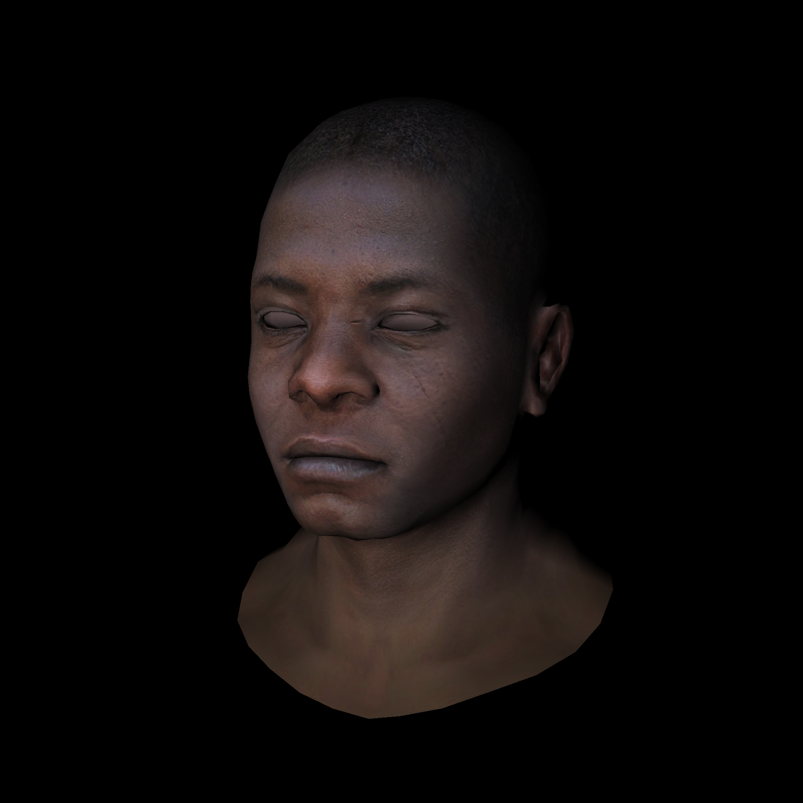

# Tiny render
A simple python application rendering 3D model.



# Requirements
* python3
* virtualenv
* pillow

# Launch
```bash
git clone https://github.com/pribavkindenis/tiny-render.git
cd ./tiny-render/
./install.sh
./run.sh
```